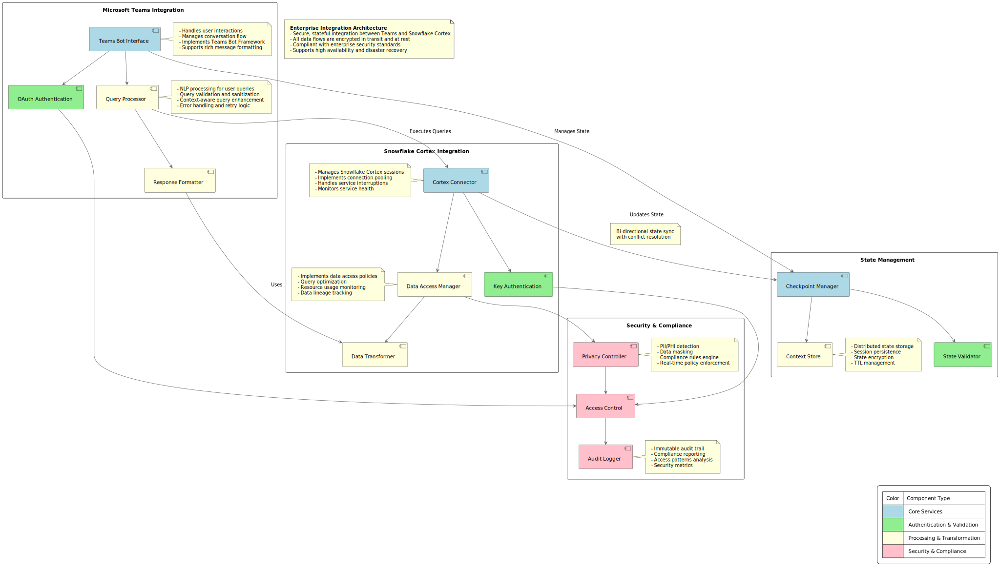

# Architecture Documentation

## System Architecture

### Overview
The Cortex Teams Chatbot system uses a modern, scalable architecture designed for enterprise deployment.

## Components

### Microsoft Teams Integration
The Teams integration layer manages user interactions and query processing:
- **Teams Bot Interface**: Primary entry point for user interactions
- **OAuth Authentication**: Handles secure user authentication via Microsoft OAuth 2.0
- **Query Processor**: Transforms natural language queries into structured requests
- **Response Formatter**: Formats Cortex data for Teams display

### Snowflake Cortex Integration
The Cortex integration layer manages data access and transformation:
- **Cortex Connector**: Core service for Snowflake Cortex communication
- **Key Authentication**: Manages secure key-based authentication with Snowflake
- **Data Access Manager**: Controls and optimizes data retrieval
- **Data Transformer**: Converts raw data into user-friendly formats

### State Management
The state management layer maintains conversation context:
- **Checkpoint Manager**: Orchestrates state saving and restoration
- **State Validator**: Ensures state integrity and security
- **Context Store**: Persists conversation context and user sessions

### Security & Compliance
The security layer enforces enterprise security policies:
- **Privacy Controller**: Enforces data privacy rules
- **Access Control**: Manages authorization across systems
- **Audit Logger**: Tracks all system interactions for compliance

## Key Features
1. **Secure Authentication**: Dual authentication system for both Teams and Cortex
2. **Stateful Conversations**: Maintains context across user sessions
3. **Data Privacy**: Enterprise-grade security controls
4. **Audit Compliance**: Comprehensive logging for all operations
5. **Scalable Architecture**: Modular design for enterprise scalability

## Implementation Notes
- Components use color coding to indicate their primary function
- All data flows through security validation
- State management ensures conversation continuity
- Modular design allows for component updates and replacements 