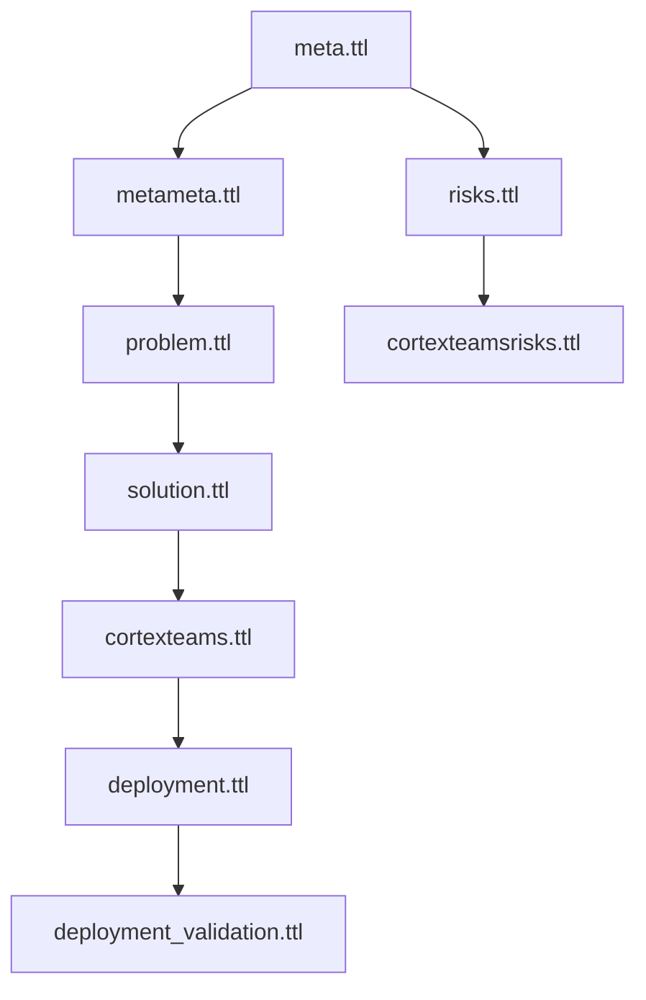

# Ontology Framework Documentation

## Overview
The Cortex Teams Chatbot system uses a layered ontology approach to model its domain, components, and relationships. The ontology framework provides a formal representation of the system's knowledge, requirements, and behaviors.

## Ontology Structure

### Core Framework (Upstream)
- `meta.ttl`: Core concepts and relationships
- `metameta.ttl`: Meta-level concepts for ontology management
- `risks.ttl`: Base risk management concepts
- Other upstream ontologies in `ontology-framework/`

### Project-Specific Ontologies

#### Domain Layer
- `problem.ttl`: Problem space definition
- `solution.ttl`: Solution components and patterns
- `cortexteams.ttl`: Teams-specific concepts and relationships

#### Implementation Layer
- `deployment.ttl`: Deployment patterns and configurations
- `deployment_validation.ttl`: Validation rules and constraints
- `cortexteamsrisks.ttl`: Teams-specific risk extensions

## Ontology Relationships



## Key Concepts

### Core Concepts
- **Problem Domain**: Defined in `problem.ttl`
  - Business requirements
  - User needs
  - Constraints

- **Solution Space**: Defined in `solution.ttl`
  - Architecture components
  - Integration patterns
  - Data models

### Teams Integration
- **Teams Components**: Defined in `cortexteams.ttl`
  - UI elements
  - Authentication flows
  - Message handling

### Deployment
- **Deployment Patterns**: Defined in `deployment.ttl`
  - Infrastructure requirements
  - Scaling rules
  - Security configurations

## Validation Framework

The validation framework ensures:
1. Ontology consistency
2. Requirement coverage
3. Security compliance
4. Performance constraints

## Usage Guidelines

### Adding New Concepts
1. Identify the appropriate ontology layer
2. Check for existing concepts
3. Follow naming conventions
4. Add necessary relationships
5. Update validation rules

### Extending Risk Models
1. Use `cortexteamsrisks.ttl` for Teams-specific risks
2. Reference base concepts from upstream `risks.ttl`
3. Add mitigation strategies
4. Update validation rules

### Deployment Validation
1. Use `deployment_validation.ttl` for rules
2. Reference deployment patterns
3. Add security constraints
4. Define performance metrics

## Development Workflow

1. **Ontology Updates**
   ```bash
   # Validate changes
   python tools/validate_ontology.py

   # Generate documentation
   python tools/generate_docs.py
   ```

2. **Integration Testing**
   ```bash
   # Test ontology consistency
   python tools/test_ontology.py

   # Validate relationships
   python tools/validate_relationships.py
   ```

## Best Practices

1. **Naming Conventions**
   - Use CamelCase for classes
   - Use camelCase for properties
   - Use descriptive prefixes

2. **Documentation**
   - Add rdfs:label
   - Add rdfs:comment
   - Include examples

3. **Versioning**
   - Use semantic versioning
   - Document changes
   - Maintain backwards compatibility

4. **Testing**
   - Validate before commits
   - Test relationships
   - Check consistency

## Common Issues and Solutions

### Issue: Concept Overlap
**Solution**: Use `owl:equivalentClass` or `rdfs:subClassOf`

### Issue: Missing Relationships
**Solution**: Add inverse properties and cardinality constraints

### Issue: Validation Failures
**Solution**: Check consistency and update validation rules

## Future Improvements

1. **Planned Extensions**
   - Additional ML concepts
   - Enhanced security patterns
   - Performance metrics

2. **Integration Plans**
   - GraphQL integration
   - API documentation
   - Automated testing

3. **Documentation**
   - Interactive visualizations
   - Query examples
   - Pattern catalog
