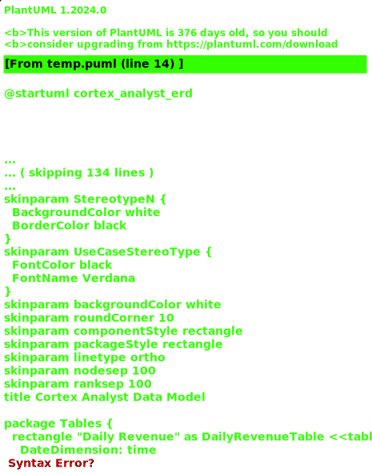

# Cortex Analyst Component

## Data Model
This diagram shows the data model for the Cortex Analyst system, including script traceability.

## Component Dependencies
This diagram shows the dependencies between components and their creation scripts.

## Deployment Architecture
This diagram shows the deployment architecture with script traceability.

## Script Execution Flow
This diagram shows the execution order of deployment scripts with validation steps.

## Script Details

1. `create_schema.sql`: Sets up databases and schemas
   - Creates CORTEX_ANALYST_DEMO database
   - Creates REVENUE_TIMESERIES schema
   - Creates TEAMS_BOT_DB database
   - Creates PUBLIC schema
   - Configures initial permissions

2. `create_tables.sql`: Creates tables and relationships
   - Creates daily_revenue fact table for revenue tracking
   - Creates product_dim dimension table for product data
   - Creates region_dim dimension table for regional data
   - Sets up foreign key relationships
   - Implements change tracking triggers

3. `create_bot_user.sql`: Sets up security and bot configuration
   - Creates bot user and role with appropriate permissions
   - Creates security_audit_log table for event tracking
   - Creates key rotation procedure for security
   - Creates security event logging procedure
   - Configures audit trail mechanisms

4. `cortex_search_create.sql`: Sets up search functionality
   - Creates Cortex search service for data discovery
   - Configures search on product_line
   - Sets up search indexes and optimization
   - Configures search result formatting
