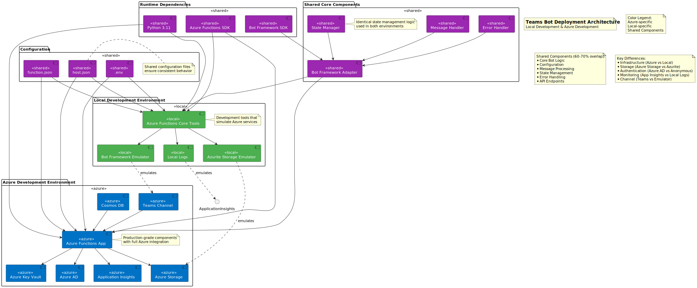

# Teams Bot Deployment Architecture

This document describes the deployment architecture for the Teams Bot, showing both Local Development and Azure Development environments with their overlapping components and unique characteristics.

## Combined Deployment View

The deployment architecture is defined in the `deployment.ttl` ontology file. The architecture diagram can be generated from this ontology using the visualization tools in `tools/visualization_engine.py`.

To generate the deployment diagram:

```bash
python -m tools.visualization_engine --ontology deployment.ttl --output docs/images/deployment_architecture.svg
```



The architecture is defined using semantic relationships in the ontology, which ensures consistency and enables automated validation. Key relationships include:

- `:usedIn` - Indicates which environment(s) a component is used in
- `:dependsOn` - Shows dependencies between components
- `:emulates` - Shows how local components emulate Azure services

## Key Observations

1. **Core Components (Shared)**
   - Bot Framework Adapter
   - State Manager
   - Message Handler
   - Error Handler
   - These components ensure consistent behavior across environments

2. **Configuration (Shared)**
   - Identical configuration files
   - Environment variables structure
   - Function bindings and routes
   - Enables smooth transition between environments

3. **Azure-Specific Components**
   - Production-grade services
   - Integrated security
   - Enterprise monitoring
   - Teams channel integration
   - Scalable storage solutions

4. **Local-Specific Components**
   - Development tools
   - Local emulators
   - Simplified authentication
   - Direct debugging capabilities

## Benefits of This Architecture

1. **Development Efficiency**
   - Local development matches production behavior
   - Quick iteration cycles
   - Reduced debugging complexity

2. **Deployment Confidence**
   - High component overlap (60-70%)
   - Consistent configuration
   - Reliable testing environment

3. **Maintenance Simplicity**
   - Single codebase
   - Shared core logic
   - Clear component boundaries

4. **Security**
   - Environment-appropriate security measures
   - Secrets management
   - Authentication flexibility

## Future Considerations

1. **Planned Enhancements**
   - Azure Key Vault integration
   - Cosmos DB state management
   - Enhanced monitoring
   - Production environment setup

2. **Scaling Considerations**
   - Component isolation
   - State management optimization
   - Performance monitoring
   - Resource scaling

## References

- [Azure Functions Documentation](https://docs.microsoft.com/en-us/azure/azure-functions/)
- [Bot Framework Documentation](https://docs.microsoft.com/en-us/azure/bot-service/)
- [Teams Integration Guide](https://docs.microsoft.com/en-us/microsoftteams/platform/bots/how-to/create-a-bot-for-teams) 