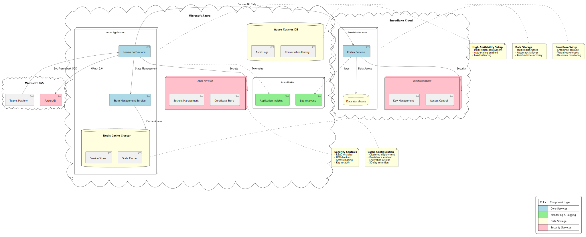

# Deployment Guide

## Overview
This guide covers the deployment process for the Cortex Teams Chatbot system across different environments and scales.



## Prerequisites

### Azure Resources
- Azure subscription with admin access
- Azure AD application registration
- Azure Key Vault instance
- Azure Container Registry

### Microsoft Teams
- Teams admin access
- App registration permissions
- Bot Framework registration

### Development Environment
- Python 3.10+
- Conda package manager
- Azure CLI
- Teams Toolkit

## Deployment Types

### Development Deployment
```bash
# Create development environment
conda env create -f environment.yml
conda activate chatbot-env

# Configure local settings
cp .env.example .env
# Edit .env with your settings

# Start development server
python src/manage.py runserver
```

### Staging Deployment
```bash
# Deploy to staging
az deployment group create \
  --name staging-deployment \
  --resource-group rg-cortex-teams-staging \
  --template-file deployment/azure/template.json \
  --parameters @deployment/azure/parameters.staging.json
```

### Production Deployment
```bash
# Deploy to production
az deployment group create \
  --name prod-deployment \
  --resource-group rg-cortex-teams-prod \
  --template-file deployment/azure/template.json \
  --parameters @deployment/azure/parameters.prod.json
```

## Configuration

### Environment Variables
```env
# Azure Configuration
AZURE_TENANT_ID=your_tenant_id
AZURE_CLIENT_ID=your_client_id
AZURE_CLIENT_SECRET=your_client_secret

# Teams Configuration
TEAMS_APP_ID=your_teams_app_id
TEAMS_BOT_ID=your_bot_id
TEAMS_BOT_PASSWORD=your_bot_password

# ML Configuration
MODEL_ENDPOINT=your_model_endpoint
MODEL_API_KEY=your_api_key

# Monitoring
APPLICATIONINSIGHTS_CONNECTION_STRING=your_connection_string
```

### Security Configuration
1. Enable managed identity
2. Configure RBAC roles
3. Set up Key Vault access
4. Configure network security groups

### Scaling Configuration
```yaml
# deployment/azure/scaling.yaml
autoscaling:
  minReplicas: 2
  maxReplicas: 10
  targetCPUUtilization: 70
  targetMemoryUtilization: 80
```

## Deployment Process

### 1. Infrastructure Setup
```bash
# Create resource group
az group create --name rg-cortex-teams --location eastus2

# Deploy infrastructure
az deployment group create \
  --name infrastructure \
  --resource-group rg-cortex-teams \
  --template-file deployment/azure/infrastructure.json
```

### 2. Application Deployment
```bash
# Build container
docker build -t cortex-teams-bot .

# Push to registry
az acr build --registry your-registry --image cortex-teams-bot:latest .

# Deploy application
az containerapp up \
  --name cortex-teams-bot \
  --resource-group rg-cortex-teams \
  --image your-registry.azurecr.io/cortex-teams-bot:latest
```

### 3. Teams Integration
1. Register bot in Teams
2. Upload manifest
3. Configure permissions
4. Test integration

## Monitoring and Maintenance

### Health Checks
```bash
# Check application health
curl https://your-app-url/health

# Check ML model health
curl https://your-app-url/health/ml

# Check Teams connection
curl https://your-app-url/health/teams
```

### Logging
```bash
# View application logs
az containerapp logs show \
  --name cortex-teams-bot \
  --resource-group rg-cortex-teams \
  --follow

# Export logs
az monitor export \
  --resource-group rg-cortex-teams \
  --name log-export \
  --storage-account your-storage
```

### Backup and Recovery
```bash
# Backup configuration
az backup create \
  --resource-group rg-cortex-teams \
  --vault-name backup-vault \
  --name config-backup

# Restore from backup
az backup restore \
  --resource-group rg-cortex-teams \
  --vault-name backup-vault \
  --name config-backup \
  --restore-mode Original
```

## Troubleshooting

### Common Issues

1. **Authentication Failures**
   ```bash
   # Check Azure AD token
   az account get-access-token

   # Test Teams connection
   python tools/test_teams_auth.py
   ```

2. **Scaling Issues**
   ```bash
   # Check metrics
   az monitor metrics list \
     --resource your-resource-id \
     --metric-names CPU Memory
   ```

3. **ML Model Issues**
   ```bash
   # Test model endpoint
   python tools/test_model.py

   # Check model logs
   az monitor logs query \
     --workspace your-workspace \
     --query 'your-query'
   ```

## Security Considerations

### Data Protection
1. Enable encryption at rest
2. Configure TLS 1.3
3. Implement key rotation
4. Set up data backup

### Access Control
1. Configure RBAC
2. Enable MFA
3. Set up conditional access
4. Monitor access logs

### Compliance
1. Enable audit logging
2. Configure retention policies
3. Set up compliance reporting
4. Monitor security metrics

## Performance Optimization

### Caching Strategy
1. Configure Redis cache
2. Set up CDN
3. Implement query caching
4. Configure browser caching

### Resource Optimization
1. Configure autoscaling
2. Optimize container resources
3. Configure load balancing
4. Monitor resource usage

## Rollback Procedures

### Quick Rollback
```bash
# Rollback to previous version
az containerapp revision restore \
  --name cortex-teams-bot \
  --resource-group rg-cortex-teams \
  --revision previous
```

### Full Rollback
```bash
# Restore infrastructure
az deployment group create \
  --name rollback \
  --resource-group rg-cortex-teams \
  --template-file deployment/azure/rollback.json

# Restore data
az backup restore \
  --resource-group rg-cortex-teams \
  --vault-name backup-vault \
  --name full-backup
```
