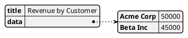
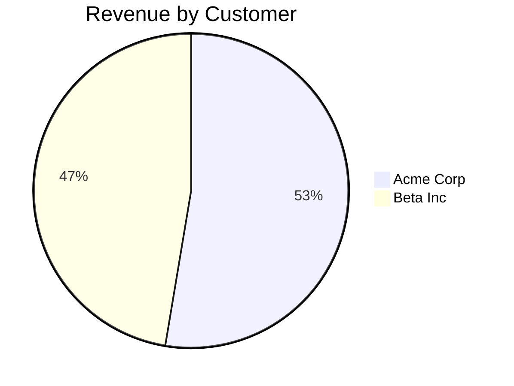

# Core Use Cases

## UC1: User Access Management

### UC1.1: User Onboarding
**Description:** Add user access through Teams group membership

**Flow:**
1. Admin assigns user to authorized Teams group
2. System detects group membership change
3. System maps Teams identity to Snowflake role
4. System provisions necessary access tokens
5. User receives welcome message with quick start guide

**Example:**
```text
System Event: User "alice@company.com" added to "Cortex-Analytics" Teams group
Action:
1. Map to Snowflake role "ANALYST_ROLE"
2. Generate OAuth tokens
3. Create user context in StateManager
4. Send welcome message
```

### UC1.2: Access Verification
**Prerequisites:**
- User must be in authorized Teams group
- Corresponding Snowflake role must exist
- Required permissions must be configured

**Constraints:**
- Maximum 1000 users per group
- Role mapping must be pre-configured
- Access review required every 90 days

## UC2: Cortex Query Execution

### UC2.1: Natural Language Query
**Description:** User submits natural language query in Teams chat

**Flow:**
1. User types query in Teams chat
2. System parses natural language
3. System translates to Snowflake SQL
4. Query executes with user's permissions
5. Results are formatted and returned

**Example:**
```text
User: "Show me top 10 customers by revenue for last quarter"

System Translation:
SELECT
    c.customer_name,
    SUM(o.order_amount) as revenue
FROM customers c
JOIN orders o ON c.customer_id = o.customer_id
WHERE o.order_date >= DATEADD(quarter, -1, CURRENT_DATE())
GROUP BY c.customer_name
ORDER BY revenue DESC
LIMIT 10;

Response: [Formatted results in Teams message]
```

### UC2.2: Query Builder Interface
**Description:** Visual interface for complex query construction

**Flow:**
1. User requests query builder
2. System displays adaptive card with fields
3. User selects tables/columns/filters
4. System generates and validates query
5. Query executes with preview

**Example:**
```text
User: "@CortexBot build query"
Bot: [Displays Adaptive Card with:]
- Table selection dropdown
- Column picker
- Filter conditions
- Sort options
- Preview button
```

## UC3: Result Formatting

### UC3.1: Text Results
**Description:** Format query results as text/tables

**Formats:**
1. Markdown Tables (default)
```text
| Customer | Revenue |
|----------|---------|
| Acme Corp| $50,000 |
| Beta Inc | $45,000 |
```

2. CSV Format
```text
Customer,Revenue
Acme Corp,50000
Beta Inc,45000
```

### UC3.2: Visual Results
**Description:** Generate visualizations from query results

**Supported Formats:**
1. PlantUML Charts


2. Mermaid Charts


3. Teams Adaptive Cards
```json
{
  "type": "AdaptiveCard",
  "body": [
    {
      "type": "ColumnSet",
      "columns": [
        {
          "type": "Column",
          "items": [
            {
              "type": "TextBlock",
              "text": "Customer"
            }
          ]
        }
      ]
    }
  ]
}
```

### UC3.3: Export Options
**Description:** Export results in various formats

**Supported Exports:**
1. Excel (.xlsx)
2. CSV
3. JSON
4. PDF (for reports)

**Example:**
```text
User: "@CortexBot export results to Excel"
Bot: "Generating Excel file..."
[Provides downloadable link to results]
```

## UC4: Context Management

### UC4.1: Query Context Preservation
**Description:** Maintain context for follow-up queries

**Example:**
```text
User: "Show me top customers"
Bot: [Displays customer list]
User: "Now show their orders"
Bot: [Understands context, shows orders for previously listed customers]
```

### UC4.2: Session Management
**Description:** Manage user session state

**Flow:**
1. Track active queries
2. Store temporary results
3. Manage query history
4. Handle timeout/cleanup

## Implementation Requirements

### Result Formatting Engine
1. Input Handlers:
   - Snowflake result sets
   - Error messages
   - Status updates

2. Format Processors:
   - Text formatter (tables, lists)
   - Chart generator (PlantUML, Mermaid)
   - Adaptive Card builder
   - Export formatter

3. Output Validators:
   - Size limits check
   - Format compatibility
   - Teams message constraints

### Performance Requirements
1. Format Conversion:
   - Text conversion: < 100ms
   - Chart generation: < 500ms
   - Export generation: < 2s

2. Size Limits:
   - Teams message: < 25KB
   - Chart complexity: < 100 elements
   - Export size: < 10MB

### Error Handling
1. Format Failures:
   - Fallback to simpler format
   - Error notification
   - Retry logic
   - User guidance

2. Size Violations:
   - Result pagination
   - Truncation with notification
   - Export suggestion
