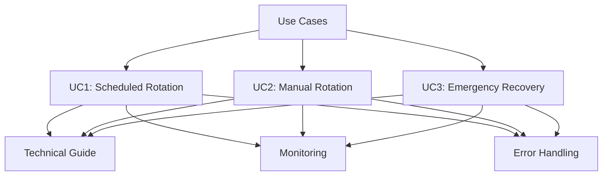
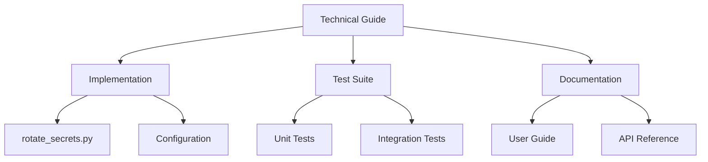
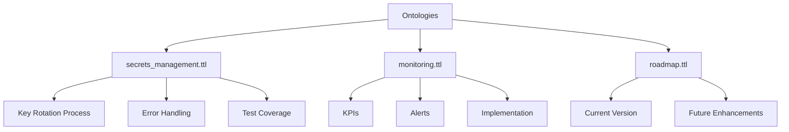
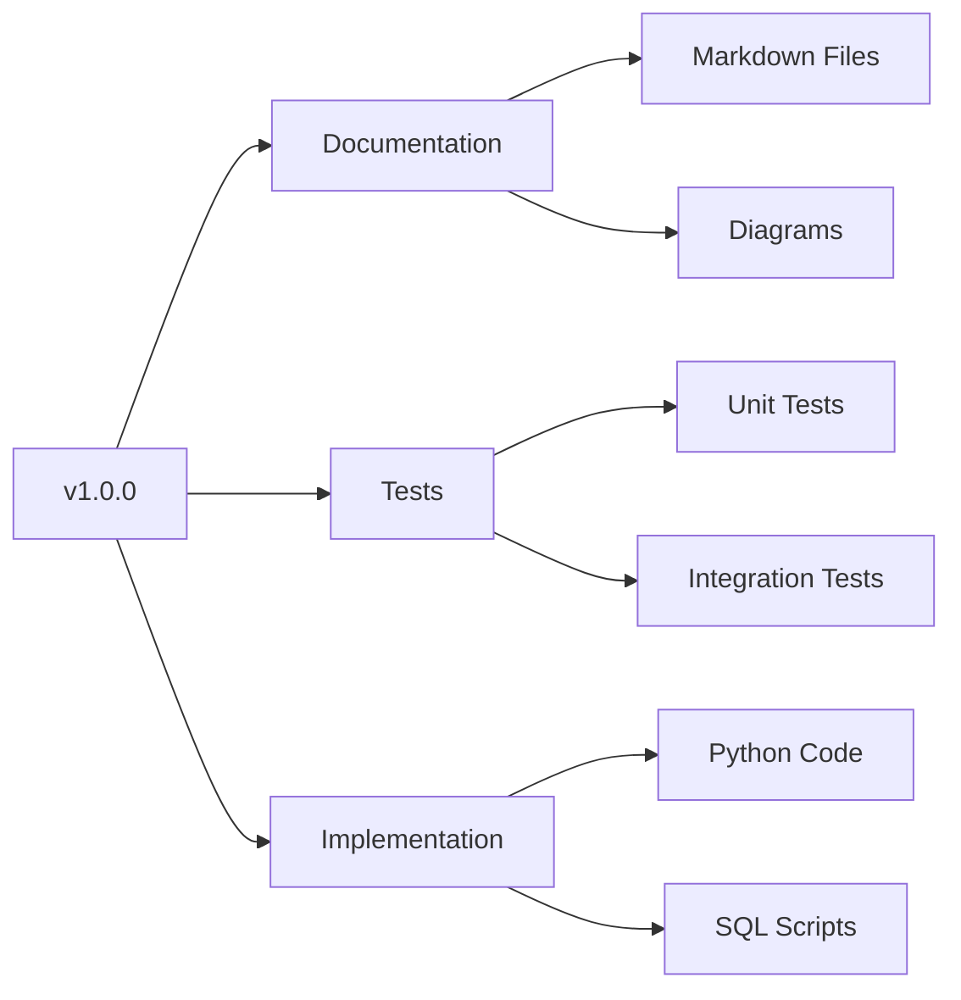

# Key Rotation Documentation Map

## Overview

This document maps the relationships between all components of the key rotation documentation suite.

## Core Components

### Use Cases

### Technical Implementation

### Ontology Structure

## Component Cross-References

### Documentation to Implementation
- Use Cases → Technical Guide
  - `scheduled-rotation.md` → `key_rotation.md#automated-key-rotation`
  - `manual-rotation.md` → `key_rotation.md#manual-key-rotation`
  - `emergency-recovery.md` → `key_rotation.md#emergency-recovery`

### Implementation to Tests
- Source → Test Files
  - `rotate_secrets.py` → `test_rotate_secrets.py`
  - Error Handling → Error Test Cases
  - Monitoring → Monitoring Test Cases

### Ontology to Documentation
- `secrets_management.ttl` → Use Cases
  - `secrets:KeyRotationProcess` → Process Flows
  - `secrets:ErrorHandling` → Error Categories
  - `secrets:TestCoverage` → Test Requirements

### Monitoring to Implementation
- `monitoring.ttl` → Monitoring Code
  - KPIs → Metrics Collection
  - Alerts → Alert Configuration
  - Implementation → CloudWatch Setup

## Version Control

### Documentation Versioning

## Related Documentation

- [Key Rotation Technical Guide](../../key_rotation.md)
- [Ontology Documentation](../../ontology.md)
- [Test Coverage Report](../../test_coverage.md) 