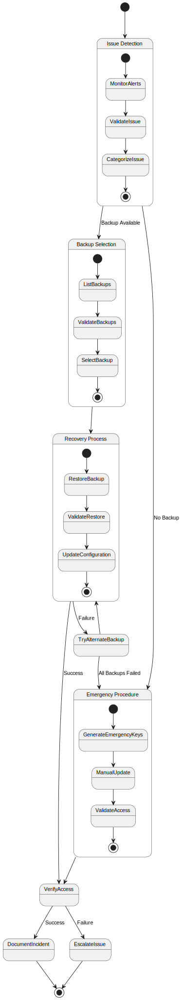

# UC3: Emergency Key Recovery

## Overview

**Primary Actor**: System Administrator

**Description**: Recover from failed key rotation or compromised keys.

**Technical Implementation**: See [Emergency Recovery](../../key_rotation.md#emergency-recovery)

**Ontology Reference**: `secrets:EmergencyKeyRecovery` in [secrets_management.ttl](../../secrets_management.ttl)

## Requirements

### Preconditions
- Backup keys available
- ACCOUNTADMIN role access available
- System access maintained

### Postconditions
- Working keys restored
- System access reestablished
- Incident documented
- New backups created

## Process Flow

### Main Flow
1. Administrator identifies key issue
2. System lists available backups
3. Administrator selects backup to restore
4. System restores selected backup
5. System validates restored keys
6. Administrator verifies system access

### Alternative Flows

#### A1: No valid backups available
1. Administrator generates new emergency keys
2. Manually updates Snowflake
3. Updates backup storage

#### A2: Validation fails after restore
1. System attempts alternate backup
2. If all backups fail, escalate to emergency procedure

## Process Diagram



## Error Handling

For detailed error handling procedures, see:
- [Error Categories](error-handling.md#error-categories)
- [Technical Troubleshooting](../../key_rotation.md#troubleshooting)

## Monitoring

For monitoring details, see:
- [Monitoring Requirements](monitoring.md)
- [Technical Monitoring](../../key_rotation.md#monitoring-and-validation)

## Implementation Status

**Version**: 1.0.0
**Last Updated**: 2024-03-21
**Status**: Implemented

## Ontology Traceability

```turtle
@prefix secrets: <../../secrets_management.ttl#> .
@prefix test: <../../test_coverage.ttl#> .

secrets:EmergencyKeyRecovery a secrets:KeyRotationProcess ;
    rdfs:label "Emergency Key Recovery Process" ;
    secrets:requiresRole "ACCOUNTADMIN" ;
    secrets:hasTestCase test:EmergencyRecoveryTest ;
    secrets:hasImplementation secrets:EmergencyRecoveryImpl .

secrets:EmergencyRecoveryTest a secrets:TestCase ;
    rdfs:label "Emergency Recovery Test" ;
    test:function "test_emergency_recovery" ;
    test:verifies "Backup restoration, validation, emergency key generation" .
```

## Related Documentation

- [Scheduled Key Rotation](scheduled-rotation.md)
- [Manual Key Rotation](manual-rotation.md)
- [Technical Implementation](../../key_rotation.md#emergency-recovery) 