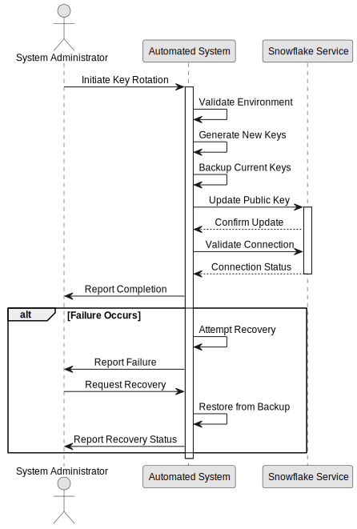

# UC2: Manual Key Rotation

## Overview

**Primary Actor**: System Administrator

**Description**: Manually initiate and monitor key rotation process.

**Technical Implementation**: See [Manual Key Rotation](../../key_rotation.md#manual-key-rotation)

**Ontology Reference**: `secrets:ManualKeyRotation` in [secrets_management.ttl](../../secrets_management.ttl)

## Requirements

### Preconditions
- Administrator has CLI access
- ACCOUNTADMIN role access available
- Required dependencies installed ([see technical guide](../../key_rotation.md#dependencies))

### Postconditions
- New keys installed or previous state restored
- Administrator notified of outcome
- Logs updated with actions taken

## Process Flow

### Main Flow
1. Administrator initiates rotation command
2. System displays progress updates
3. Administrator monitors execution
4. System reports completion status
5. Administrator verifies success

### Alternative Flows

#### A1: Administrator cancels rotation
1. System performs cleanup
2. Restores previous state
3. Reports cancellation

#### A2: Administrator requests recovery
1. System attempts to restore from backup
2. Validates restored state
3. Reports recovery status

## Process Diagram



## Error Handling

For detailed error handling procedures, see:
- [Error Categories](error-handling.md#error-categories)
- [Technical Troubleshooting](../../key_rotation.md#troubleshooting)

## Monitoring

For monitoring details, see:
- [Monitoring Requirements](monitoring.md)
- [Technical Monitoring](../../key_rotation.md#monitoring-and-validation)

## Implementation Status

**Version**: 1.0.0
**Last Updated**: 2024-03-21
**Status**: Implemented

## Ontology Traceability

```turtle
@prefix secrets: <../../secrets_management.ttl#> .
@prefix test: <../../test_coverage.ttl#> .

secrets:ManualKeyRotation a secrets:KeyRotationProcess ;
    rdfs:label "Manual Key Rotation Process" ;
    secrets:requiresRole "ACCOUNTADMIN" ;
    secrets:hasTestCase test:ManualRotationTest ;
    secrets:hasImplementation secrets:ManualKeyRotationImpl .
```

## Related Documentation

- [Scheduled Key Rotation](scheduled-rotation.md)
- [Emergency Key Recovery](emergency-recovery.md)
- [Technical Implementation](../../key_rotation.md#manual-key-rotation) 