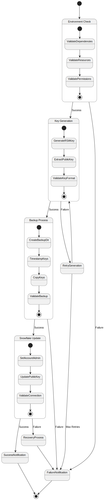

# UC1: Scheduled Key Rotation

## Overview

**Primary Actor**: Automated System

**Description**: Automatically rotate Snowflake authentication keys on a scheduled basis.

**Technical Implementation**: See [Automated Key Rotation](../../key_rotation.md#automated-key-rotation)

**Ontology Reference**: `secrets:ScheduledKeyRotation` in [secrets_management.ttl](../../secrets_management.ttl)

## Requirements

### Preconditions
- ACCOUNTADMIN role access available (see [Security Considerations](../../key_rotation.md#security-considerations))
- Current keys are valid and working
- Required dependencies installed ([see technical guide](../../key_rotation.md#dependencies))
- Sufficient disk space for backups

### Postconditions
- New keys installed and working
- Old keys backed up
- Metrics and logs updated ([see monitoring](monitoring.md))
- Notifications sent

## Process Flow

### Main Flow
1. System validates environment requirements
   - See [Environment Errors](error-handling.md#environment-errors)
   - Implementation: [rotate_secrets.py](../../teams_bot/scripts/rotate_secrets.py)
2. Generates new RSA key pair
   - See [Key Generation Failures](error-handling.md#operation-errors)
3. Extracts and formats public key
4. Creates backup of existing keys
   - See [Backup Issues](error-handling.md#recovery-errors)
5. Updates Snowflake with new public key
6. Validates new key connection
7. Emits success metrics and notifications
   - See [Monitoring Requirements](monitoring.md)

### Alternative Flows

#### A1: Environment validation fails
1. Log validation errors
   - See [Error Categories](error-handling.md#error-categories)
2. Notify administrators
   - See [Alert Configuration](monitoring.md#alert-configuration)
3. Exit without making changes

#### A2: Key generation fails
1. Log error details
2. Retry up to 3 times
3. If all retries fail, notify administrators
   - See [Emergency Recovery](emergency-recovery.md)

#### A3: Snowflake update fails
1. Log error details
2. Restore previous key from backup
   - See [Manual Recovery](manual-rotation.md#alternative-flows)
3. Validate restored key
4. Notify administrators

## Process Diagram



## Error Handling

For detailed error handling procedures, see:
- [Error Categories](error-handling.md#error-categories)
- [Technical Troubleshooting](../../key_rotation.md#troubleshooting)

## Monitoring

For monitoring details, see:
- [Monitoring Requirements](monitoring.md)
- [Technical Monitoring](../../key_rotation.md#monitoring-and-validation)

## Implementation Status

**Version**: 1.0.0
**Last Updated**: 2024-03-21
**Status**: Implemented

## Ontology Traceability

```turtle
@prefix secrets: <../../secrets_management.ttl#> .
@prefix test: <../../test_coverage.ttl#> .
@prefix monitor: <../../monitoring.ttl#> .

secrets:ScheduledKeyRotation a secrets:KeyRotationProcess ;
    rdfs:label "Scheduled Key Rotation Process" ;
    secrets:requiresRole "ACCOUNTADMIN" ;
    secrets:hasTestCase test:ScheduledRotationTest ;
    secrets:hasImplementation secrets:ScheduledKeyRotationImpl ;
    monitor:hasKPI monitor:SuccessRate,
                  monitor:BackupHealth,
                  monitor:SecurityMetrics .

secrets:ScheduledRotationTest a secrets:TestCase ;
    rdfs:label "Scheduled Rotation Test" ;
    test:function "test_scheduled_rotation" ;
    test:verifies "Automation, validation, monitoring" .
```

## Related Documentation

- [Manual Key Rotation](manual-rotation.md)
- [Emergency Key Recovery](emergency-recovery.md)
- [Technical Implementation](../../key_rotation.md#automated-key-rotation)
- [Documentation Map](documentation_map.md) 