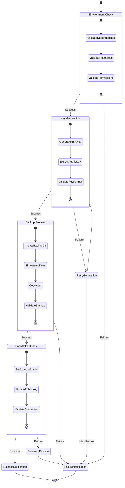
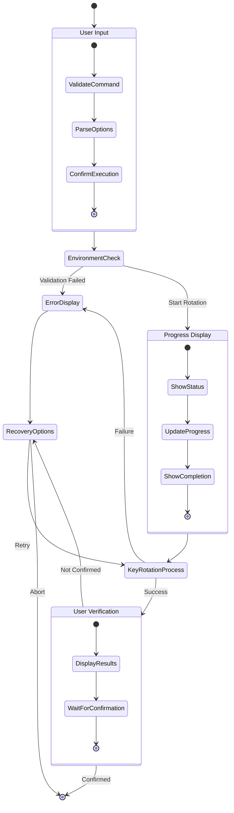
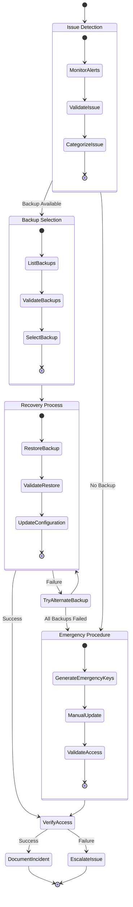
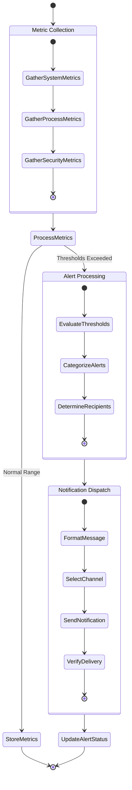
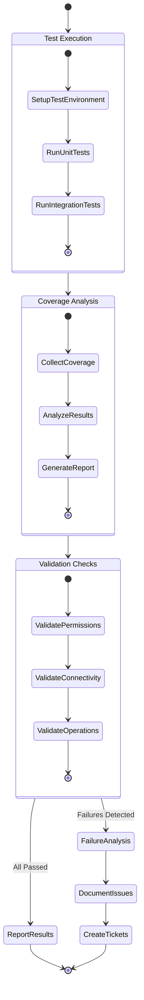
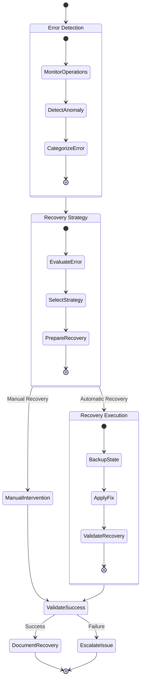

# Snowflake Key Rotation Activity Diagrams

## Scheduled Key Rotation Activity

## Manual Key Rotation Activity

## Emergency Recovery Activity

## Monitoring and Metrics Activity

## Validation and Testing Activity

## Error Recovery Flow

