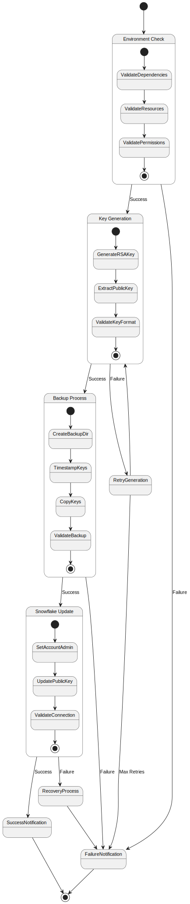

# Snowflake Key Rotation Use Cases

## Overview

This document outlines the primary use cases for the Snowflake Key Rotation Process, including actors, flows, and requirements. For technical implementation details and script usage, see [Key Rotation Technical Guide](../key_rotation.md).

## Actors

1. **System Administrator**
   - Initiates key rotation process
   - Monitors rotation status
   - Handles failures and recovery

2. **Automated System**
   - Executes key rotation steps
   - Performs validation checks
   - Manages backups
   - Emits metrics and notifications

3. **Snowflake Service**
   - Validates and accepts new keys
   - Authenticates connections
   - Enforces role permissions

## Primary Use Cases

### UC1: Scheduled Key Rotation

**Primary Actor**: Automated System

**Description**: Automatically rotate Snowflake authentication keys on a scheduled basis.

**Preconditions**:
- ACCOUNTADMIN role access available
- Current keys are valid and working
- Required dependencies installed
- Sufficient disk space for backups

**Main Flow**:
1. System validates environment requirements
2. Generates new RSA key pair
3. Extracts and formats public key
4. Creates backup of existing keys
5. Updates Snowflake with new public key
6. Validates new key connection
7. Emits success metrics and notifications

**Alternative Flows**:
- A1: Environment validation fails
  1. Log validation errors
  2. Notify administrators
  3. Exit without making changes

- A2: Key generation fails
  1. Log error details
  2. Retry up to 3 times
  3. If all retries fail, notify administrators

- A3: Snowflake update fails
  1. Log error details
  2. Restore previous key from backup
  3. Validate restored key
  4. Notify administrators

**Postconditions**:
- New keys installed and working
- Old keys backed up
- Metrics and logs updated
- Notifications sent

### UC2: Manual Key Rotation

**Primary Actor**: System Administrator

**Description**: Manually initiate and monitor key rotation process.

**Preconditions**:
- Administrator has CLI access
- ACCOUNTADMIN role access available
- Required dependencies installed

**Main Flow**:
1. Administrator initiates rotation command
2. System displays progress updates
3. Administrator monitors execution
4. System reports completion status
5. Administrator verifies success

**Alternative Flows**:
- A1: Administrator cancels rotation
  1. System performs cleanup
  2. Restores previous state
  3. Reports cancellation

- A2: Administrator requests recovery
  1. System attempts to restore from backup
  2. Validates restored state
  3. Reports recovery status

**Postconditions**:
- New keys installed or previous state restored
- Administrator notified of outcome
- Logs updated with actions taken

### UC3: Emergency Key Recovery

**Primary Actor**: System Administrator

**Description**: Recover from failed key rotation or compromised keys.

**Preconditions**:
- Backup keys available
- ACCOUNTADMIN role access available
- System access maintained

**Main Flow**:
1. Administrator identifies key issue
2. System lists available backups
3. Administrator selects backup to restore
4. System restores selected backup
5. System validates restored keys
6. Administrator verifies system access

**Alternative Flows**:
- A1: No valid backups available
  1. Administrator generates new emergency keys
  2. Manually updates Snowflake
  3. Updates backup storage

- A2: Validation fails after restore
  1. System attempts alternate backup
  2. If all backups fail, escalate to emergency procedure

**Postconditions**:
- Working keys restored
- System access reestablished
- Incident documented
- New backups created

## Technical Requirements

For detailed technical requirements, environment setup, and script usage instructions, please refer to the [Key Rotation Technical Guide](../key_rotation.md).

### Monitoring Requirements

1. **Metrics**
   - Key rotation success rate
   - Rotation duration
   - Backup status
   - Recovery attempts

2. **Alerts**
   - Failed rotations
   - Failed recoveries
   - Permission issues
   - Resource constraints

## Error Handling

### Error Categories

1. **Environment Errors**
   - Missing dependencies
   - Insufficient resources
   - Permission issues

2. **Operation Errors**
   - Key generation failures
   - Backup failures
   - Update failures
   - Validation failures

3. **Recovery Errors**
   - Backup corruption
   - Restore failures
   - Validation failures

### Recovery Procedures

1. **Automatic Recovery**
   - Retry failed operations
   - Restore from recent backup
   - Validate restored state

2. **Manual Recovery**
   - Administrator intervention
   - Emergency key generation
   - Manual Snowflake updates

## Future Enhancements

1. **Automation**
   - Automated scheduling
   - Self-healing capabilities
   - Predictive maintenance

2. **Security**
   - Enhanced key encryption
   - Multi-region backups
   - Audit trail improvements

3. **Monitoring**
   - Advanced metrics
   - Predictive analytics
   - Automated reporting

## Related Documents

- [Key Rotation Technical Guide](../key_rotation.md)
- [Test Coverage Documentation](../../test_coverage.ttl)
- [Security Requirements](../security_requirements.md)
- [Monitoring Guide](../monitoring_guide.md) 